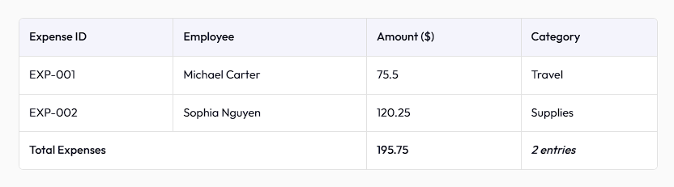

# TableNex - A Next-Gen React Table Component



Say goodbye to the hassle of `<tr>` and `<td>` chaos—TableNex offers an effortless, customizable, and responsive solution for modern tables. Built with React and TypeScript, it’s perfect for lists, dashboards, or complex datasets.

## Why TableNex?

- **Effortless Setup**: Define data and columns(optional) no manual HTML.
- **Customizable**: Tailor styles and colors to your project.
- **Responsive**: Works on desktop and mobile.
- **Advanced Features**: Fixed columns, expanded rows, and more.
- **Developer-Friendly**: TypeScript-ready with error catching.

## Installation

Install via npm:

```bash
npm install react-tablenex
```

## Getting Started

Here’s a simple table:
Next, import the component and its CSS in your file:

## Quick Start

Here’s a simple example to get you started. This creates a basic table with some employee data:

```jsx
import React from "react";
import TableNex from "react-tablenex";
import "react-tablenex/style.css";

function MyTable() {
  const data = [
    {
      id: 1,
      name: "John",
      age: 28,
      job: "Coder",
      salary: 75000,
      location: "New York",
      country: "USA",
    },
    {
      id: 2,
      name: "Jane",
      age: 34,
      job: "Designer",
      salary: 85000,
      location: "San Francisco",
      country: "USA",
    },
  ];

  return <TableNex data={data} />;
}

export default MyTable;
```

- **`data`**: An array of objects where each object is a row.

Save this in a `.jsx` or `.tsx` file, run your app, and you’ll see a table!

---

## Props Overview

`TableNex` comes with many options (props) to customize your table. Here’s a beginner-friendly breakdown:

| Prop            | Type                    | Default           | Description                                                                 |
| --------------- | ----------------------- | ----------------- | --------------------------------------------------------------------------- |
| `data`          | `Object[]`              | Required          | Your table data as an array of objects (e.g., `[{ id: 1, name: "John" }]`). |
| `columns`       | `TableColumn[]`         | `[]`              | Defines table columns (e.g., `{ accessor: "name", header: "Name" }`).       |
| `fixedColumns`  | `string[]`              | `[]`              | Columns to "stick" (stay visible when scrolling).                           |
| `styledRows`    | `StyledRow[]`           | `[]`              | Custom styles for specific rows by their key value.                         |
| `styledColumns` | `StyledColumn[]`        | `[]`              | Custom styles for specific columns by their accessor.                       |
| `expandedRows`  | `ExpandedRow[]`         | `[]`              | Extra rows that expand below specific rows.                                 |
| `footer`        | `FooterRow[]`           | `[]`              | Rows to show at the bottom of the table.                                    |
| `keyField`      | `string`                | `"id"`            | The unique field in `data` (e.g., `"id"`) for row identification.           |
| `noDataMessage` | `string` or `ReactNode` | `"No data found"` | What to show if `data` is empty.                                            |
| `colorScheme`   | `Partial<ColorScheme>`  | See below         | Colors for the table (e.g., `{ PRIMARY: "#fff" }`).                         |
| `responsive`    | `boolean`               | `false`           | Makes the table adapt to mobile screens.                                    |
| `styles`        | `Partial<TableStyles>`  | See below         | Controls spacing, borders, and rounded corners.                             |

### Default `colorScheme`

```json
{
  "PRIMARY": "#ffffff",
  "SECONDARY": "#f9f8fd",
  "ACCENT": "#f9f8fd",
  "BORDER": "#f2f2f2"
}
```

### Default `styles`

```json
{
  "rounded": "sm",
  "spacing": "md",
  "columnBorder": "none",
  "rowBorder": "sm",
  "fontSize": "0.9rem"
}
```

> **Tip**: Use `"sm"`, `"md"`, `"lg"`, `"xl"`, or `"none"` for `rounded`, `spacing`, `columnBorder`, and `rowBorder`.

### Responsive Table with Footer

A more advanced table with responsive design and a footer:

```jsx
import TableNex from "react-tablenex";
import "react-tablenex/style.css";

function FullTable() {
  const data = [
    {
      employeeId: 1,
      name: "John",
      salary: 75000,
      location: "New York",
      country: "USA",
    },
    {
      employeeId: 2,
      name: "Jane",
      salary: 95000,
      location: "San Francisco",
      country: "USA",
    },
  ];

  const columns = [
    { accessor: "employeeId", header: "Employee ID" },
    { accessor: "name", header: "Employee" },
    { accessor: "salary", header: "Salary ($)" },
    { accessor: "location", header: "Location" },
    { accessor: "country", header: "Country" },
  ];

  const footer = [
    {
      cells: [
        { content: "Total", style: { fontWeight: "bold" }, colSpan: 4},
        { content: "$170,000" },
      ],
    },
  ];

  return (
    <TableNex
      data={data}
      keyField="employeeId"
      columns={columns}
      footer={footer}
      responsive={true}
      styles={{ rounded: "lg", spacing: "lg", columnBorder: "sm" }}
    />
  );
}
```

- `responsive={true}` makes it mobile-friendly.
- `footer` shows a summary row.
- `styles` adjusts the look with larger corners and spacing.

### `keyField` Note

- Defaults to `"id"`. Set it to a unique column (e.g., `"employeeId"`) if your data uses something else. It’s key for features like styling rows or expanding content.

## More Features

- **Fixed Columns**: Pin with `fixedColumns={["orderId"]}`.
- **Expanded Rows**: Add details with `expandedRows={[{ afterRowKey: "#1001", element: <div>Details</div> }]}`.
- **Footer**: Summarize with `footer={[{ cells: [{ content: "Total" }] }]}`.
- **Tailwind**: Use `className` (e.g., `!bg-red-500`) in `styledRows`/`styledColumns`.

---

## Styling

`TableNex` uses CSS custom properties for easy theming. You can:

1. **Use the Default CSS**: Import `"react-tablenex/style.css"`.
2. **Override with Props**:
   ```jsx
   <TableNex
     data={data}
     colorScheme={{ PRIMARY: "#f0f0f0", BORDER: "#000" }}
     styles={{ fontSize: "1rem", rowBorder: "lg" }}
   />
   ```
3. **Add Custom CSS**: Use classes like `.tablenex_table`, `.tablenex_row`, etc., from your own stylesheet.

Check your browser’s developer tools to see all available classes!

## Learn More

### Check the [full documentation](http://tablenex.devvarena.com/docs/introduction) for advanced usage and TypeScript details.

Happy coding with `TableNex`!
